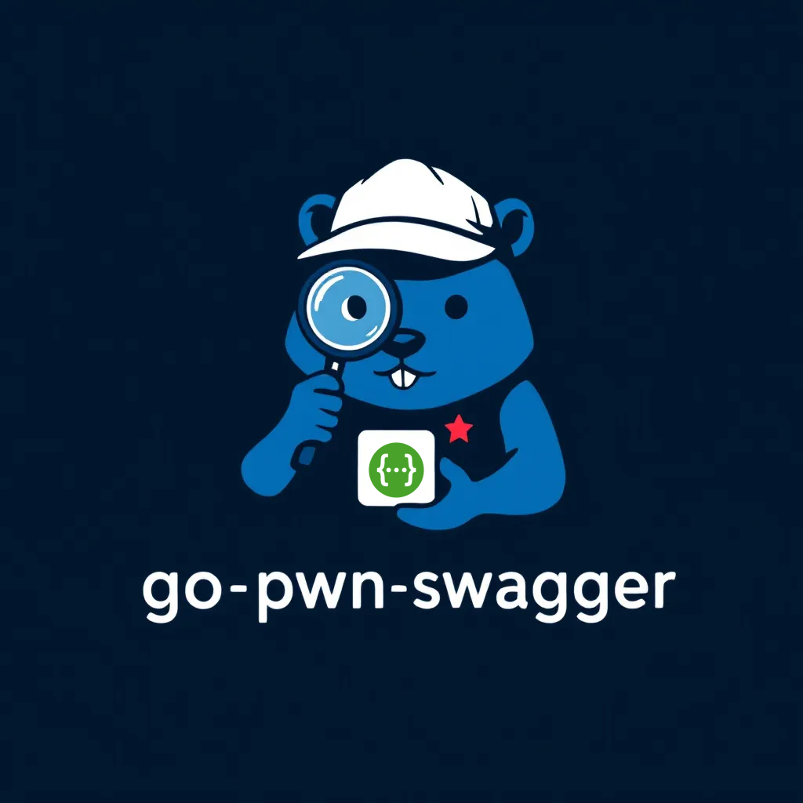

<p align="center">
  
</p>

<p align="center">
  <a href="https://goreportcard.com/report/github.com/Abhinandan-Khurana/go-pwn-swagger"></a>
  <a href="LICENSE"></a>
  <a href="https://golang.org/doc/devel/release.html"></a>

</p>

A comprehensive Swagger UI version detection and vulnerability scanner written in Go. 
This tool helps security professionals, developers, and API maintainers identify the Swagger UI version in use and any associated security vulnerabilities.

## 🚀 Features

- Detects Swagger UI versions from v1.x to v5.x using multiple methods
- Identifies known vulnerabilities associated with specific Swagger UI versions
- Supports concurrent scanning of multiple targets
- Provides detailed vulnerability information and references
- Uses headless browser capabilities for dynamic JavaScript detection
- Offers both CLI output and JSON export options
- Multiple detection methods to ensure accuracy:
  - JavaScript execution and object inspection
  - Static pattern analysis of JS code
  - DOM structure analysis
  - Asset filename inspection
  - HTTP header analysis

## 📋 Prerequisites

- Go 1.22 or higher
- Chrome/Chromium browser (for headless browser detection)

## 💻 Direct Installation

```bash
go install -v github.com/Abhinandan-Khurana/go-pwn-swagger@latest
```

## 💻 Installation

```bash
# Clone the repository
git clone https://github.com/Abhinandan-Khurana/go-pwn-swagger.git
cd go-pwn-swagger

# Install dependencies
go mod tidy

# Build the binary
go build -o go-pwn-swagger
```

## 🔧 Usage

```bash
# Scan a single URL
./go-pwn-swagger -url https://example.com/swagger-ui/

# Scan multiple URLs from a file
./go-pwn-swagger -file urls.txt -concurrency 10

# Output results to JSON file
./go-pwn-swagger -url https://example.com/swagger-ui/ -output results.json

# Enable verbose output
./go-pwn-swagger -url https://example.com/swagger-ui/ -verbose

# Display help information
./go-pwn-swagger -help
```

## 📝 Example Output

```
Swagger UI Version Detector and Vulnerability Scanner
   ____ _____        ____ _      ______        ______      ______ _____ _____ ____  _____
  / __ -/ __ \______/ __ \ | /| / / __ \______/ ___/ | /| / / __ -/ __ -/ __ -/ _ \/ ___/
 / /_/ / /_/ /_____/ /_/ / |/ |/ / / / /_____(__  )| |/ |/ / /_/ / /_/ / /_/ /  __/ /
 \__- /\____/     / -___/|__/|__/_/ /_/     /____/ |__/|__/\__-_/\__- /\__- /\___/_/
/____/           /_/                                            /____//____/
~ Made with ❤️ by Abhinandan-Khurana (@l0u51f3r007)                             v1.0.0

====================================================
Scanning 1 URLs with concurrency level 5

URL: https://petstore.swagger.io/
  Major Version: 5.x
  Specific Version: 5.19.0
  Confidence: 0.95
  Detection Method: JavaScript Execution
  Potential Vulnerabilities:
    - No known vulnerabilities for Swagger UI 5.x at this time

====================================================

Scan completed!
Remember to verify findings manually before making security decisions.
Swagger UI version detection is based on heuristics and may not be 100% accurate.
```

## 🛡️ Known Vulnerabilities

The tool identifies various Swagger UI vulnerabilities including:

| Severity | Vulnerability | Vulnerable Versions |
|----------|---------------|---------------------|
| Medium   | Server-side Request Forgery (SSRF) | < 4.1.3 |
| Medium   | Insecure Defaults | < 3.26.1 |
| Medium   | Relative Path Overwrite (RPO) | < 3.23.11 |
| Medium   | Cross-site Scripting (XSS) | >=2.0.3 <2.0.24, >=3.0.0 < 3.0.13, < 2.2.1, < 3.20.9, < 3.4.2, < 2.2.3 |
| Medium   | Reverse Tabnabbing | < 3.18.0 |
| Critical | Cross-site Scripting (XSS) | <2.1.0 |
| High     | Cross-site Scripting (XSS) | <2.2.1 |

## 🔍 How It Works

1. **URL Processing**: Fetches the target URL(s) and extracts HTML content
2. **Resource Collection**: Gathers JavaScript files and other resources
3. **Multi-layered Detection**:
   - Executes JavaScript in a headless browser to extract version information
   - Analyzes HTML DOM structure for version-specific patterns
   - Checks for version signatures in JavaScript code
   - Examines asset filenames for version indicators
4. **Vulnerability Mapping**: Maps detected versions to known security issues
5. **Confidence Scoring**: Assigns confidence levels to detected versions
6. **Result Reporting**: Formats and presents findings with vulnerability details

## 🤝 Contributing

Contributions are welcome! Please feel free to submit a Pull Request.

1. Fork the repository
2. Create your feature branch (`git checkout -b feature/amazing-feature`)
3. Commit your changes (`git commit -m 'Add some amazing feature'`)
4. Push to the branch (`git push origin feature/amazing-feature`)
5. Open a Pull Request

## 📄 License

This project is licensed under the MIT License - see the LICENSE file for details.

## 👨‍💻 Author

Made with ❤️ by [Abhinandan Khurana](https://github.com/Abhinandan-Khurana)

---

**Disclaimer**: This tool is meant for security research and testing purposes only. Always obtain proper authorization before scanning systems you don't own. 